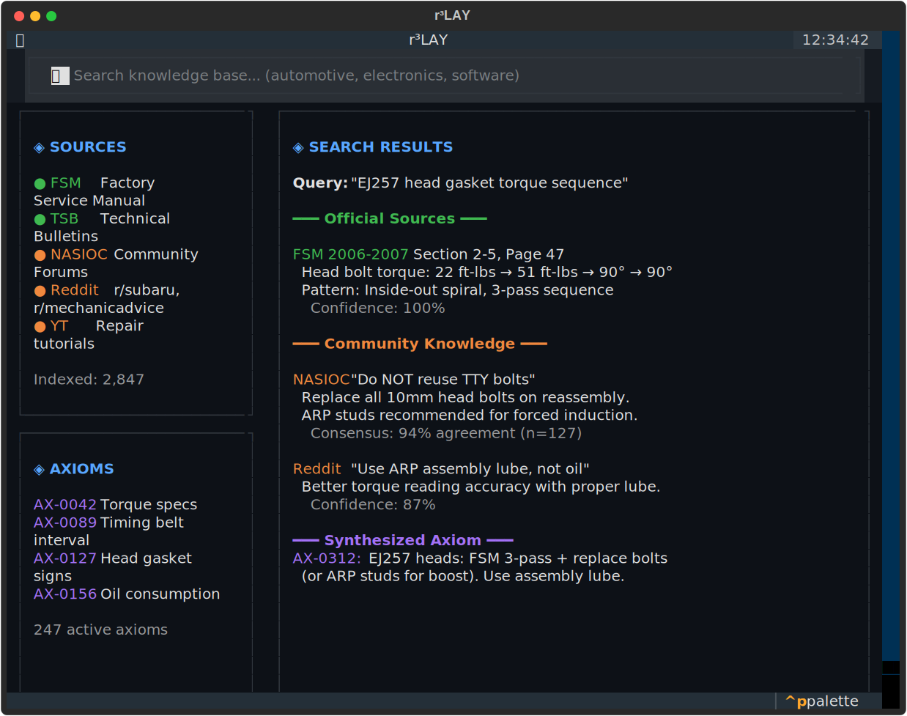

# r³LAY

**Retrospective Recursive Research, Linked Archive Yield**

> A TUI AI research assistant that bridges official documentation with real world community knowledge.

[](https://github.com/dlorp/r3LAY/actions/workflows/ci.yml)
[](https://github.com/dlorp/r3LAY)
[](https://www.python.org/downloads/)
[](LICENSE)
[](https://github.com/dlorp/r3LAY)



---

## Philosophy

Official documentation tells you the spec. Community knowledge tells you what actually works.

**r³LAY bridges the gap:**

| Source Type | What It Provides | Example |
|-------------|------------------|---------|
| **Official** | Specifications, procedures | "Torque to 72 ft-lbs" |
| **Community** | Real-world experience | "Use 65 ft-lbs on aluminum heads" |
| **r³LAY** | Synthesized, provenance-tracked axioms | "72 ft-lbs (FSM), 65 ft-lbs for aluminum (NASIOC consensus)" |

The system doesn't just accumulate facts it **revises earlier conclusions** when new evidence demands it. That's the "Retrospective" in r³LAY.

### Target Domains

Built with a **garage hobbyist / tinkerer lens**:

- **Automotive** — Parts interchange, proven fixes, real torque specs
- **Electronics** — Component substitutions, actual vs rated specs
- **Software** — Workarounds, undocumented behavior, what actually works
- **Home/DIY** — Tool recommendations, technique variations

---

## Features

### Core Capabilities

| Feature | Description |
|---------|-------------|
| **Local LLM Inference** | MLX (Apple Silicon), llama.cpp (GGUF/universal), Ollama (API) |
| **Smart Model Routing** | Automatic text/vision model switching based on content |
| **Hybrid RAG Search** | BM25 + vector search with RRF fusion and source attribution |
| **Deep Research (R³)** | Multi cycle expeditions with convergence detection |
| **Retrospective Revision** | Automatic contradiction detection and resolution |
| **Provenance Tracking** | Every fact linked to its source via Signals system |
| **Axiom Management** | Validated knowledge with confidence scores and state lifecycle |
| **Terminal-Native UI** | Built with Textual, fully keyboard-driven workflow |

### LLM Backend Support

| Backend | Platform | Use Case |
|---------|----------|----------|
| **MLX** | Apple Silicon | Native Metal acceleration, recommended for M1/M2/M3/M4 |
| **llama.cpp** | Universal | GGUF models, CPU or CUDA acceleration |
| **Ollama** | Any | API based, easiest setup |

### Knowledge Systems

- **Signals** — Track provenance of all knowledge sources (documents, web, community, user input)
- **Axioms** — Validated knowledge statements with confidence scores and state lifecycle
- **Citations** — Link axioms back to their source signals with location and excerpt
- **Contradiction Detection** — Automatically identifies conflicts between new findings and existing axioms
- **Resolution Cycles** — Spawns targeted research to resolve disputes

---

## Quick Start

### Installation

```bash
# Clone and install
git clone https://github.com/dlorp/r3LAY.git
cd r3lay
pip install -e .

# For Apple Silicon (MLX support)
pip install mlx mlx-lm

# For NVIDIA GPUs (llama.cpp with CUDA)
CMAKE_ARGS="-DGGML_CUDA=on" pip install llama-cpp-python
```

### First Run

```bash
# Point at any project folder
r3lay ~/Documents/my-project

# Or run without arguments for current directory
r3lay
```

The TUI will launch. Select a model from the Models panel (Tab+M) and start chatting.

### Docker

Run r³LAY in Docker with SearXNG for web search:

```bash
# Clone the repository
git clone https://github.com/dlorp/r3LAY.git
cd r3lay

# Start with SearXNG (for /research web search)
docker compose --profile default up -d
PROJECT_PATH=/path/to/your/project docker compose run r3lay

# Or standalone (no web search)
docker compose --profile standalone run r3lay-standalone
```

For NVIDIA GPU support:

```bash
docker compose --profile nvidia build
docker compose --profile nvidia run r3lay-nvidia
```

See [docs/docker.md](docs/docker.md) for configuration options and troubleshooting.

---

## Usage

### Chat Mode

Just type your question and press Enter. r³LAY will:

1. Search your indexed documents (if available)
2. Include relevant context with source attribution in the LLM prompt
3. Stream the response with citations

### Smart Model Routing

r³LAY automatically switches between text and vision models based on your message:

| Trigger | Action |
|---------|--------|
| Attach an image | Switch to vision model |
| Vision keywords ("describe", "diagram", etc.) | Switch to vision if score > 0.6 |
| 5+ text-only messages on vision | Switch back to text model |

The router uses **asymmetric thresholds**: high bar (0.6) to switch TO vision, low bar (0.1) to STAY on vision. This minimizes unnecessary model swaps since vision models handle text fine.

### Commands

| Command | Description |
|---------|-------------|
| `/help` | Show available commands |
| `/index <path>` | Index files for RAG search |
| `/reindex` | Rebuild the entire index |
| `/search <query>` | Search indexed documents |
| `/research <query>` | Start deep research expedition |
| `/axiom [category:] <statement>` | Create a new axiom |
| `/axioms [category]` | List axioms (optionally filter by category) |
| `/axioms --disputed` | Show axioms needing resolution |
| `/cite <id>` | Show provenance chain for axiom |
| `/dispute <id> <reason>` | Mark an axiom as disputed |
| `/clear` | Start new session |

### Deep Research (R³)

```bash
/research EJ25 head gasket failure patterns
```

r³LAY will:

1. Generate search queries from your research question
2. Search web (via SearXNG) and local index in parallel
3. Extract axioms from findings using the LLM
4. Detect contradictions with existing knowledge
5. Run resolution cycles when disputes arise
6. Stop when research converges (diminishing returns)
7. Synthesize a final report with full provenance

The R³ methodology enables **retrospective revision**—if cycle 3 contradicts something from cycle 1, r³LAY doesn't just add the new fact. It marks the old axiom as disputed, runs targeted resolution queries, and either supersedes, confirms, or merges the conflicting information.

---

## Keybindings

| Key | Action |
|-----|--------|
| `Tab` | Cycle focus between panes |
| `Ctrl+M` | Focus Models panel |
| `Ctrl+I` | Focus Index panel |
| `Ctrl+A` | Focus Axioms panel |
| `Ctrl+R` | Reindex project |
| `Ctrl+L` | Clear response pane |
| `Ctrl+Q` | Quit (graceful model unload) |
| `Escape` | Cancel current operation |

---

## Architecture

```
┌─────────────────────────────────┬─────────────────────────────────┐
│                                 │  User Input                     │
│   Response Pane                 │  Multi line TextArea            │
│   (Markdown rendering)          ├─────────────────────────────────┤
│                                 │  Tabbed Panels                  │
│   60% width                     │  [Models][Index][Axioms]        │
│                                 │  [Sessions][Settings]           │
└─────────────────────────────────┴─────────────────────────────────┘
```

### Core Components

| Component | Purpose |
|-----------|---------|
| **LLM Backends** | Pluggable adapters for MLX, llama.cpp, Ollama |
| **Hybrid Index** | BM25 + vector search with RRF fusion (k=60) |
| **Signals** | Provenance tracking for all knowledge sources |
| **Axioms** | Validated knowledge with 7 state lifecycle |
| **Research Orchestrator** | Multi cycle expedition with retrospective revision |
| **Smart Router** | Automatic text/vision model switching |

### Knowledge Flow

```
Signal (source) → Transmission (excerpt) → Citation → Axiom (validated fact)
```

### Signal Types

| Type | Weight | Example |
|------|--------|---------|
| DOCUMENT | 0.95 | FSM, datasheet, official manual |
| CODE | 0.90 | Config file, source code |
| USER | 0.80 | User-provided information |
| COMMUNITY | 0.75 | Forum post, discussion thread |
| WEB | 0.70 | Web search result |
| INFERENCE | 0.60 | LLM-derived conclusion |

### Axiom States

```
PENDING → VALIDATED
    ↓         ↓
REJECTED   DISPUTED → SUPERSEDED
               ↓
           INVALIDATED
```

---

## Configuration

### Environment Variables

r³LAY supports configuration via environment variables with the `R3LAY_` prefix:

| Variable | Description | Default |
|----------|-------------|---------|
| `R3LAY_OLLAMA_ENDPOINT` | Ollama API endpoint | `http://localhost:11434` |
| `R3LAY_SEARXNG_ENDPOINT` | SearXNG API endpoint | `http://localhost:8080` |
| `R3LAY_HF_CACHE_PATH` | HuggingFace model cache | Auto-detected |
| `R3LAY_MLX_FOLDER` | MLX models directory | Auto-detected |
| `R3LAY_GGUF_FOLDER` | GGUF models directory | `~/.r3lay/models` |

Example:

```bash
R3LAY_OLLAMA_ENDPOINT=http://remote-server:11434 r3lay ~/project
```

### Project Configuration

Project-level configuration is stored in `<project>/.r3lay/config.yaml`:

```yaml
# Model role assignments (set via UI or auto-saved on load)
model_roles:
  text_model: Qwen2.5-7B-Instruct-mlx-4bit
  vision_model: Qwen2.5-VL-7B-Instruct-mlx-4bit
  text_embedder: mlx-community/all-MiniLM-L6-v2-4bit
  vision_embedder: openai/clip-vit-base-patch32
```

### Project Data Structure

```
<project>/
├── .r3lay/
│   ├── config.yaml          # Model role assignments
│   ├── index/               # Hybrid RAG index
│   │   ├── bm25_*.json      # BM25 index data
│   │   └── vectors_*.npy    # Vector embeddings
│   ├── sessions/            # Chat session history
│   └── .signals/
│       ├── sources.yaml     # Signal definitions
│       └── citations.yaml   # Citation chains
├── axioms/
│   └── axioms.yaml          # Validated knowledge
└── research/
    └── expedition_*/        # Research expedition results
        ├── expedition.yaml  # Metadata and cycles
        └── report.md        # Final synthesis
```

---

## Requirements

### Hardware

| Platform | Minimum | Recommended |
|----------|---------|-------------|
| **Apple Silicon** | M1, 16GB | M2/M3/M4 Pro, 32GB |
| **NVIDIA** | RTX 3060 12GB | RTX 3080+ 12GB+ |
| **CPU-only** | 16GB RAM | 32GB RAM |

### Software

- Python 3.11+
- For Apple Silicon: macOS 13+ with MLX
- For NVIDIA: CUDA 12.0+ with cuDNN
- For Docker: Docker Engine 20.10+

### Recommended Models

| Role | Model | Size | Notes |
|------|-------|------|-------|
| Text | Qwen2.5-7B-Instruct | ~4GB (4-bit) | Excellent instruction following |
| Vision | Qwen2-VL-7B-Instruct | ~5GB (4-bit) | Strong visual understanding |
| Embeddings | all-MiniLM-L6-v2 | ~80MB | Fast, good quality |

---

## Development

```bash
# Install dev dependencies
pip install -e ".[dev]"

# Run tests
pytest tests/ -v

# Type checking
mypy r3lay/

# Linting
ruff check r3lay/
```

### Project Structure

```
r3lay/
├── r3lay/
│   ├── app.py                # Main Textual application
│   ├── config.py             # Pydantic settings with env var support
│   ├── core/
│   │   ├── backends/         # LLM backend adapters
│   │   ├── models.py         # Model discovery
│   │   ├── index.py          # Hybrid RAG index
│   │   ├── signals.py        # Provenance tracking
│   │   ├── axioms.py         # Knowledge management
│   │   ├── research.py       # R³ orchestrator
│   │   ├── search.py         # SearXNG client
│   │   ├── router.py         # Smart model routing
│   │   └── session.py        # Chat sessions
│   └── ui/
│       ├── widgets/          # TUI components
│       └── styles/           # TCSS stylesheets
├── docs/
│   ├── docker.md             # Docker deployment guide
│   └── troubleshooting.md    # Common issues
├── plans/                    # Implementation roadmaps
├── Dockerfile                # Standard container
├── Dockerfile.nvidia         # NVIDIA GPU container
└── docker-compose.yaml       # Multi-service deployment
```

---

## Roadmap

All planned phases are complete:

- [x] **Phase 1**: TUI shell with bento layout
- [x] **Phase 2**: Model discovery (HuggingFace, GGUF, Ollama)
- [x] **Phase 3**: LLM backends (MLX, llama.cpp, Ollama)
- [x] **Phase 4**: Hybrid RAG index with source attribution
- [x] **Phase 5**: Smart model routing (text/vision switching)
- [x] **Phase 6**: Signals & Axioms (provenance and knowledge systems)
- [x] **Phase 7**: Deep Research with R³ methodology
- [x] **Phase 8**: Error handling, Docker deployment, documentation

### Future Possibilities

- vLLM backend for high throughput NVIDIA inference
- Web UI alternative to TUI
- Multi-user collaboration on axiom validation
- Export to knowledge graph formats
- Integration with external knowledge bases

---

## Troubleshooting

See [docs/troubleshooting.md](docs/troubleshooting.md) for common issues and solutions.

Quick fixes:

| Issue | Solution |
|-------|----------|
| Model not loading | Check memory (7B models need ~8GB) |
| Ollama connection refused | Run `ollama serve` first |
| SearXNG unavailable | Start with `docker compose --profile search up -d` |
| Slow embeddings | Use MLX backend on Apple Silicon |

---

## License

[PolyForm NonCommercial 1.0.0](LICENSE) — free for personal and non-commercial use.

---

## Acknowledgments

Built with:

- [Textual](https://textual.textualize.io/) — Modern TUI framework for Python
- [MLX](https://github.com/ml-explore/mlx) — Apple Silicon ML framework
- [llama.cpp](https://github.com/ggerganov/llama.cpp) — Universal LLM inference
- [Pydantic](https://docs.pydantic.dev/) — Data validation and settings
- [SearXNG](https://searxng.org/) — Privacy-respecting meta search engine

---

*r³LAY  The manual says one thing, but the forums know the truth.*
