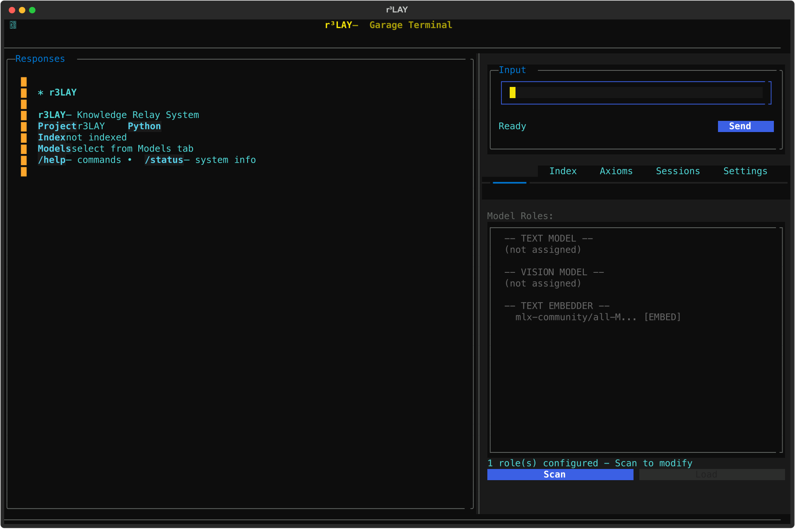

# r³LAY


[](https://python.org)
[]()


> *The manual says one thing, but the forums know the truth.*

A TUI research assistant for hobbyists who wrench on their own stuff. Whether you're maintaining a fleet of motorcycles, restoring vintage gear, or keeping your homelab alive - r³LAY helps you track what you did, find what you need, and discover what the community actually knows.

<p align="center">
  
  <br>
  <em>Track maintenance, chat with local LLMs, and research with full source attribution</em>
</p>

## Why r³LAY?

**For the tinkerer who's tired of:**
- Scattered notes across notebooks, PDFs, and browser bookmarks
- Forum posts that contradict the official manual (and are usually right)
- Forgetting when you last changed that oil/filter/belt

**r³LAY gives you:**
- 🔧 **Maintenance Tracking** - Log services, track intervals, get overdue alerts
- 💬 **Natural Language Input** - "logged oil change at 98k" just works
- 🧠 **Local LLM Inference** - MLX (Apple Silicon), llama.cpp, or Ollama
- 🔍 **Hybrid RAG Search** - BM25 + vector search with source attribution
- 📚 **Deep Research (R³)** - Multi-cycle expeditions with contradiction detection

No cloud. No subscriptions. Your data stays on your machine.

## Quick Start

```bash
git clone https://github.com/dlorp/r3LAY.git
cd r3lay
pip install -e .
```

### Platform Setup

**Apple Silicon (recommended):**
```bash
pip install mlx mlx-lm
```

**NVIDIA GPU:**
```bash
CMAKE_ARGS="-DGGML_CUDA=on" pip install llama-cpp-python
```

**CPU-only:** Works out of the box (slower, but gets the job done)

### Run

```bash
# Point at any project folder
r3lay ~/Documents/my-project

# Or current directory
r3lay
```

Select a model from the Models panel (`Tab+M`) and start chatting.

### Docker

```bash
docker compose --profile default up -d
PROJECT_PATH=/path/to/project docker compose run r3lay
```

## Commands

| Command | What it does |
|---------|--------------|
| `/log <service>` | Log a maintenance entry |
| `/due` | Show upcoming/overdue services |
| `/history` | Show maintenance history |
| `/mileage <value>` | Update odometer |
| `/index <path>` | Index files for RAG |
| `/research <query>` | Start deep research expedition |
| `/axioms` | List validated knowledge |

## Keybindings

| Key | Action |
|-----|--------|
| `Tab` | Cycle panes |
| `Ctrl+M` | Models panel |
| `Ctrl+I` | Index panel |
| `Ctrl+A` | Axioms panel |
| `Ctrl+R` | Reindex |
| `Ctrl+Q` | Quit |

## Requirements

| Platform | Minimum | Recommended |
|----------|---------|-------------|
| Apple Silicon | M1, 16GB | M2/M3/M4 Pro, 32GB |
| NVIDIA | RTX 3060 12GB | RTX 3080+ |
| CPU-only | 16GB RAM | 32GB RAM |

- Python 3.11+
- macOS 13+ (for MLX) or CUDA 12.0+ (for NVIDIA)

## Configuration

Environment variables (`R3LAY_` prefix):

```bash
R3LAY_OLLAMA_ENDPOINT=http://localhost:11434
R3LAY_SEARXNG_ENDPOINT=http://localhost:8080
R3LAY_GGUF_FOLDER=~/.r3lay/models
```

Project config lives in: `<project>/.r3lay/config.yaml`

## Documentation

**[Full Wiki →](https://github.com/dlorp/r3LAY/wiki)** 

| Guide | Description |
|-------|-------------|
| [Architecture](https://github.com/dlorp/r3LAY/wiki/ARCHITECTURE) | System design and data flow |
| [API Reference](https://github.com/dlorp/r3LAY/wiki/API) | REST endpoints |
| [Docker Setup](https://github.com/dlorp/r3LAY/wiki/docker) | Container deployment |
| [OpenClaw Integration](https://github.com/dlorp/r3LAY/wiki/openclaw-integration) | Using with OpenClaw |
| [Troubleshooting](https://github.com/dlorp/r3LAY/wiki/troubleshooting) | Common issues |

## Development

```bash
pip install -e ".[dev]"
pytest tests/ -v
mypy r3lay/
ruff check r3lay/
```

## License

[PolyForm Noncommercial 1.0.0](LICENSE) - Free for personal and non-commercial use.

---

<p align="center">
  <strong>Built for people who read service manuals for fun.</strong>
</p>
