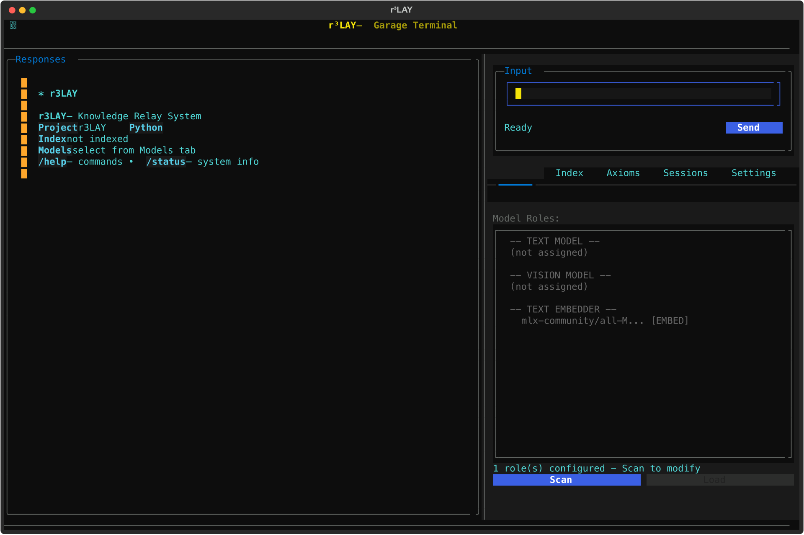

# r³LAY


[](https://python.org)
[]()


> *The manual says one thing, but the forums know the truth.*

A TUI research assistant for hobbyists who wrench on their own stuff. Whether you're maintaining a fleet of motorcycles, restoring vintage gear, or keeping your homelab alive r³LAY helps you track what you did, find what you need, and discover what the community actually knows.

<p align="center">
  
  <br>
  <em>Track maintenance, chat with local LLMs, and research with full source attribution</em>
</p>

## 🚧 Project Status — Work in Progress

r³LAY is under active development. Here's where things stand and where they're headed.

### Current State

The **automotive** category is the primary focus right now, built around my vehicle maintenance workflow. This serves as the proving ground for the core architecture before expanding to other domains.

### Vision

r³LAY is designed to let you **speak with your project itself** — a natural, conversational interface where the LLM has the *entire* history of your project: every maintenance log, every research session, every axiom you've established.

The core ideas:

- **Full project memory** — The LLM carries all history and context, so you never re-explain your setup
- **Ingest everything** — Service manuals, small codebases, config files, and notes become searchable knowledge via RAG
- **Dispute & validate** — Cross-reference community sources (forums, Reddit) against official documentation (vendor specs, service manuals) to surface contradictions and find the truth
- **Category-specific behavior** — Each category (automotive, home, electronics) can have its own knowledge base, axiom schemas, and tuned behavior

### Folder Structure

```
r3lay/
├── automotive/       ← active development (motorcycles, vehicles)
├── home/             ← planned (home maintenance, appliances)
├── electronics/      ← planned (lab gear, repairs, builds)
└── ...               ← your categories here
```

Each category folder contains its own knowledge base, maintenance logs, axioms, and configuration. The system adapts its behavior and domain knowledge based on which category you're working in.

### Contributing Categories

New categories are welcome! If you have a domain where you track projects, wrench on things, or maintain equipment — it probably fits. Open an issue to request a category or submit a PR with a new one.

---

## Why r³LAY?

**For the tinkerer who's tired of:**
- Scattered notes across notebooks, PDFs, and browser bookmarks
- Forum posts that contradict the official manual (and are usually right)
- Forgetting when you last changed that oil/filter/belt

**r³LAY gives you:**
- 🔧 **Maintenance Tracking** - Log services, track intervals, get overdue alerts 
- 💬 **Natural Language Input** - "oil change at 98k" just works in a prompt
- 🧠 **Flexible LLM Backends** - MLX, llama.cpp, Ollama, vLLM, or OpenClaw
- 🔍 **Hybrid RAG Search** - BM25 + vector search with source attribution
- 📚 **Deep Research (R³)** - Multi cycle expeditions with contradiction detection

No cloud. No subscriptions. Your data stays on your machine.

## Quick Start

```bash
git clone https://github.com/dlorp/r3LAY.git
cd r3lay
pip install -e .
```

### Platform Setup

**Apple Silicon (recommended):**
```bash
pip install mlx mlx-lm
```

**NVIDIA GPU:**
```bash
CMAKE_ARGS="-DGGML_CUDA=on" pip install llama-cpp-python
```

**CPU only:** Works out of the box (slower, but gets the job done)

### Run

```bash
# Point at any project folder
r3lay ~/Documents/my-project

# Or current directory
r3lay
```

Select a model from the Models panel (`Ctrl+1`) and start chatting.

## Project Folder Management

**r3LAY intelligently manages your project folders** — dump FSMs, service manuals, community docs, research notes, and maintenance logs into your project directory. r3LAY indexes everything and makes it conversationally accessible.

### Unified Project Structure (All Domains)

**Each domain follows the same structure:**

```bash
~/projects/automotive/1997-subaru-impreza/
├── manuals/
│   ├── FSM-1997-Impreza.pdf               # Factory service manual
│   ├── EJ22-engine-specs.pdf               # Engine technical docs
│   └── transmission-rebuild-guide.pdf      # Rebuild procedures
├── research/
│   ├── timing-belt-intervals.md            # Your research notes
│   ├── head-gasket-symptoms.md             # Community findings
│   └── obd1-ssm-protocol.md                # Protocol reverse engineering
├── maintenance/
│   ├── log.json                            # Service history (auto-managed)
│   └── receipts/                           # Parts/service receipts
├── community/
│   ├── nasioc-ej22-timing-belt-thread.pdf  # Forum archives
│   ├── reddit-subaru-ej22-FAQ.md           # Community knowledge
│   └── youtube-timing-belt-replacement.md  # Video transcripts
├── prototypes/
│   ├── obd2-tui/                           # Live OBD2 diagnostics (project-specific)
│   ├── ej22-tracker/                       # Maintenance tracking tool
│   └── dtc-timeline/                       # DTC history viewer
└── .r3lay/
    ├── project.yaml                        # Project metadata
    ├── axioms/                             # Validated findings
    └── index/                              # RAG index (auto-generated)

~/projects/embedded/casio-f91w/
├── datasheets/
│   ├── F91W-module-3239.pdf
│   └── piezo-buzzer-specs.pdf
├── research/
│   ├── sensor-watch-pinout.md
│   └── firmware-reverse-engineering.md
├── prototypes/
│   ├── sensor-watch-firmware/              # Custom firmware
│   └── f91w-mod-guide/                     # Modding tool
└── .r3lay/

~/projects/preservation/nes-tools/
├── reference-docs/
│   ├── NES-dev-manual.pdf
│   └── CHR-format-spec.md
├── research/
│   ├── pattern-table-analysis.md
│   └── save-format-research.md
├── prototypes/
│   ├── nes-pattern-tui/                    # CHR tile viewer
│   ├── nes-chr-viewer/                     # Static export tool
│   └── rom-inspector/                      # Header analysis
└── .r3lay/
```

**Key principle:** Prototypes live WITH the project they serve, not in a separate `~/repos/r3LAY/prototypes/` folder.

**What r3LAY does:**
1. **Indexes to knowledge vault:** Project docs/research → `~/repos/knowledge-vault/` → Synapse-Engine knowledge graph
2. **Queries via CGRAG API:** r3LAY asks Synapse-Engine knowledge graph for relevant findings
3. **Maintains context:** LLM knows your project history, maintenance records, research
4. **Extracts knowledge:** Service intervals from manuals → maintenance schedule
5. **Detects contradictions:** FSM says 60k timing belt, community says 105k → flags for review
6. **Personalizes responses:** "Your Impreza's EJ22..." (not generic advice)

**Workflow:**
```bash
cd ~/projects/automotive/1997-subaru-impreza
r3lay

# Chat naturally:
You: "When should I change my timing belt?"

# Behind the scenes:
# 1. r3LAY queries Synapse-Engine CGRAG API
# 2. Knowledge graph returns: subaru-ej22-timing-belt.md (from vault)
# 3. Cross-references: ej25-similarities.md, interference-engines.md
# 4. Checks project maintenance log (last service 60k miles ago)
# 5. Injects findings + context into LLM

r3LAY: "Your EJ22's timing belt interval is 105k miles (per 1999+ FSM update,
       confirmed by NASIOC consensus). You're at 120k miles (60k overdue).
       EJ22 is interference engine — failure is catastrophic.
       [Sources: FSM-1997-Impreza.pdf p.142, knowledge-vault/automotive/subaru-ej22-timing-belt.md]"

You: "Log timing belt replacement today at 120k miles, $800"
r3LAY: ✅ Logged to maintenance. Next timing belt due at 225k miles (105k interval).
       Would you like me to add this finding to the knowledge vault?

You: "Yes"
r3LAY: ✅ Created knowledge-vault/automotive/timing-belt-replacement-log.md
       Synapse-Engine will re-index on next heartbeat.
```

**Natural conversation updates** (LLM-confirmed):
- "I changed the oil today, used 5W-30" → r3LAY confirms → logs to maintenance
- "My mileage is now 120500" → r3LAY updates project
- "I installed a cold air intake" → r3LAY logs modification

**Knowledge Vault Integration (Bidirectional):**

**r3LAY and Synapse-Engine both contribute to `~/repos/knowledge-vault/`:**

All research from domain projects flows into the vault:

```
~/repos/knowledge-vault/
├── automotive/
│   ├── subaru-ej22-timing-belt.md         # From: ~/projects/automotive/1997-subaru-impreza/research/
│   ├── head-gasket-symptoms.md             # r3LAY: Community consensus
│   └── obd1-ssm-protocol.md                # r3LAY: Protocol research
├── embedded/
│   ├── sensor-watch-pinout.md              # From: ~/projects/embedded/casio-f91w/research/
│   └── f91w-firmware-mods.md
└── preservation/
    ├── nes-chr-format.md                   # From: ~/projects/preservation/nes-tools/research/
    └── gba-save-types.md
```

**Flow:**
- Research starts in project folder: `~/projects/<domain>/<project>/research/`
- r3LAY synthesizes → writes to vault: `~/repos/knowledge-vault/<domain>/<topic>.md`
- Synapse-Engine indexes vault → builds knowledge graph
- r3LAY queries knowledge graph for ANY project (cross-project learning)

**Cyclical workflow:**

1. **r3LAY creates data:**
   - Research FSMs, manuals, forums, community docs
   - Synthesizes findings (research-template.md format)
   - Writes to `~/repos/knowledge-vault/<domain>/<topic>.md`

2. **Synapse-Engine indexes:**
   - Detects new files in knowledge-vault
   - Generates embeddings + metadata
   - Builds knowledge graph (cross-references, provenance)
   - Exposes CGRAG API for semantic search

3. **r3LAY queries knowledge graph:**
   - Asks Synapse-Engine CGRAG API for relevant findings
   - Receives findings + cross-refs + provenance
   - Injects into LLM context
   - Generates response with source citations

4. **Cycle repeats:**
   - New findings from conversation → r3LAY writes to vault
   - Synapse-Engine re-indexes → knowledge compounds

**Both systems grow the vault together:**
- **r3LAY:** Research producer (creates structured findings)
- **Synapse-Engine:** Knowledge graph indexer (makes findings queryable)
- **knowledge-vault:** Shared data layer (persistent, versioned)

**Benefits:**
- **Unified structure:** All domains follow same pattern (`manuals/`, `research/`, `prototypes/`, `maintenance/`)
- **Project-scoped prototypes:** Tools live with the project they serve (not scattered in `~/repos/`)
- **Full project memory:** LLM has entire history every conversation
- **Bidirectional knowledge flow:** r3LAY writes findings → Synapse indexes → r3LAY queries
- **Knowledge graph:** Synapse-Engine links related findings across domains
- **Source attribution:** Every claim cites FSM page, forum post, or your notes
- **Contradiction detection:** Flags conflicts between official docs and community knowledge
- **Maintenance automation:** Extracts intervals from manuals → schedules services
- **Cross-project learning:** Findings from one project inform others (e.g., EJ22 → EJ25 similarities)
- **Collaborative growth:** r3LAY creates data, Synapse makes it queryable, both grow vault together

**Organization:**
```
~/projects/
├── automotive/
│   ├── 1997-subaru-impreza/         # Active project
│   └── 2005-honda-civic/            # Another vehicle
├── embedded/
│   ├── casio-f91w/                  # Watch modding
│   └── arduino-weather-station/
└── preservation/
    ├── nes-tools/                   # Retro gaming
    └── gba-tools/
```

All projects share knowledge via vault, all follow same structure.

### Docker

```bash
docker compose --profile default up -d
PROJECT_PATH=/path/to/project docker compose run r3lay
```

## Backends

r3LAY supports multiple LLM inference backends. Choose based on your hardware and needs:

### 🍎 MLX (Apple Silicon - Recommended)

**Best for:** M1/M2/M3/M4 Mac owners who want maximum performance

Native Apple Silicon inference with unified memory architecture.

```bash
pip install mlx mlx-lm
```

**Pros:**
- Fastest on Apple Silicon (2-3x faster than llama.cpp)
- Excellent memory efficiency via unified memory
- Native vision model support

**Cons:**
- macOS 13.0+ only
- Limited to Apple Silicon hardware

### 🦙 llama.cpp (Universal)

**Best for:** Cross platform flexibility, NVIDIA GPUs, CPU-only systems

Highly optimized GGUF inference engine with broad hardware support.

```bash
# CPU only
pip install llama-cpp-python

# NVIDIA GPU (CUDA)
CMAKE_ARGS="-DGGML_CUDA=on" pip install llama-cpp-python

# Apple Metal (alternative to MLX)
CMAKE_ARGS="-DGGML_METAL=on" pip install llama-cpp-python
```

**Pros:**
- Works everywhere (CPU, NVIDIA, AMD, Apple)
- Mature quantization support (Q4, Q5, Q8)
- Vision models via mmproj files

**Cons:**
- Slower than native backends (MLX on Mac, vLLM on NVIDIA)
- More memory overhead than MLX

### 🐋 Ollama (Easy Mode)

**Best for:** Beginners who want zero configuration

Standalone server that manages models and inference automatically.

```bash
# Install Ollama from https://ollama.ai
ollama pull llama3.2:1b
```

**Pros:**
- Dead simple setup
- Automatic model management
- Works out of the box

**Cons:**
- Less control over parameters
- Separate daemon to manage
- Not as fast as native backends

### ⚡ vLLM (High Performance NVIDIA)

**Best for:** NVIDIA GPUs when you need maximum throughput

High performance inference server with PagedAttention and continuous batching.

```bash
pip install vllm

# Start vLLM server
python -m vllm.entrypoints.openai.api_server \
  --model meta-llama/Llama-3.2-1B-Instruct \
  --host 0.0.0.0 \
  --port 8000
```

**Configuration:**
```bash
# In r3LAY config or env
R3LAY_VLLM_ENDPOINT=http://localhost:8000
```

**Pros:**
- 2-10x faster than llama.cpp on NVIDIA GPUs
- PagedAttention for efficient memory usage
- OpenAI-compatible API
- Vision model support (Qwen2-VL, LLaVA-NeXT, etc.)

**Cons:**
- NVIDIA GPUs only (CUDA 11.8+)
- Models loaded at server startup (not dynamic)
- Requires separate server process

**Documentation:** [vLLM Serving Guide](https://docs.vllm.ai/en/latest/serving/openai_compatible_server.html)

### 🦞 OpenClaw (Remote Claude)

**Best for:** Using Claude via OpenClaw agent without local GPU

Connect r3LAY to an OpenClaw agent for remote inference via Claude.

**Configuration:**

Select OpenClaw backend in the Models panel (`Tab+M`), then configure:
- **Model name:** Provider/model (e.g., `anthropic/claude-sonnet-4-20250514`)
- **Endpoint:** OpenClaw gateway URL (default: `http://localhost:18789`)
- **API Key:** Optional Bearer token for authentication

**Pros:**
- No local GPU required
- Access to Claude's reasoning capabilities
- OpenClaw agent can use tools and memory

**Cons:**
- Requires OpenClaw gateway running
- API costs (Anthropic charges apply)
- Network latency

**Documentation:** [OpenClaw Integration Guide](https://github.com/dlorp/r3LAY/wiki/openclaw-integration)

## Commands

r³LAY supports a rich set of slash commands for managing sessions, attachments, research, axioms, and maintenance tracking.

### Chat & Session Management

| Command | Description | Example |
|---------|-------------|---------|
| `/help` | Show all available commands | `/help` |
| `/status` | Display system status (models, index, search) | `/status` |
| `/clear` | Clear chat and conversation history | `/clear` |
| `/session` | Show current session information | `/session` |
| `/save [name]` | Save current session with optional name | `/save "EJ25 research"` |
| `/load <name>` | Load a saved session by name or ID | `/load EJ25` |
| `/sessions` | List all saved sessions | `/sessions` |

### Attachments & Images

| Command | Description | Example |
|---------|-------------|---------|
| `/attach <path>` | Attach image file(s) to next message (supports wildcards) | `/attach ~/screenshots/*.png` |
| `/attachments` | List currently attached images | `/attachments` |
| `/detach` | Clear all attachments | `/detach` |

**Alternative methods:**
- **Paste from clipboard** - Copy an image (screenshot, browser image) and paste directly into the input area
- **Drag and drop** - Drag image files from Finder directly into the input pane
- **File path paste** - Paste a file path and r³LAY will detect and attach image files

### Search & Research

| Command | Description | Example |
|---------|-------------|---------|
| `/index <query>` | Search local knowledge base (hybrid BM25 + vector) | `/index timing belt replacement` |
| `/search <query>` | Web search via SearXNG | `/search EJ25 head gasket symptoms` |
| `/research <query>` | Deep research expedition with R³ methodology | `/research causes of head gasket failure` |

**Index search with source filters:**
```bash
/index manual: timing specs        # Search only service manuals
/index doc: installation guide     # Search documents
/index code: configuration         # Search code/config files
```

**Research features:**
- Multi cycle exploration with convergence detection
- Parallel web and local RAG searches
- Automatic axiom extraction with provenance tracking
- Contradiction detection and resolution
- Synthesis report generation

### Knowledge Management (Axioms)

| Command | Description | Example |
|---------|-------------|---------|
| `/axiom [category:] <statement>` | Create new axiom with optional category | `/axiom spec: EJ25 timing belt interval is 105k miles` |
| `/axioms [category] [--disputed]` | List axioms, optionally filtered | `/axioms specifications` |
| `/cite <axiom_id>` | Show provenance chain and source citations | `/cite ax_abc123` |
| `/dispute <axiom_id> <reason>` | Mark axiom as disputed with reason | `/dispute ax_abc123 contradicts manual page 42` |

**Axiom categories:**
- `specifications` (or `spec:`) - Technical specs, dimensions, capacities
- `procedures` (or `proc:`) - Step-by-step maintenance procedures
- `compatibility` (or `compat:`) - Part compatibility, cross-references
- `diagnostics` (or `diag:`) - Troubleshooting, diagnostic codes
- `history` (or `hist:`) - Known issues, recalls, common failures
- `safety` (or `safe:`) - Safety warnings, torque specs

### Maintenance Tracking

| Command | Description | Example |
|---------|-------------|---------|
| `/log <service> <mileage>` | Log a maintenance entry | `/log oil_change 98500` |
| `/due [mileage]` | Show upcoming/overdue services | `/due 100000` |
| `/history [service] [--limit N]` | Show maintenance history | `/history oil_change --limit 5` |
| `/mileage [value]` | Update or show current mileage | `/mileage 98750` |

## Keybindings

| Key | Action |
|-----|--------|
| `Tab` | Cycle panes |
| `Ctrl+N` | New session |
| `Ctrl+Q` | Quit |
| `Ctrl+R` | Reindex |
| `Ctrl+D` | Toggle dark mode |
| `Ctrl+1` | Models panel |
| `Ctrl+2` | Index panel |
| `Ctrl+3` | Axioms panel |
| `Ctrl+4` | Log panel |
| `Ctrl+5` | Due panel |
| `Ctrl+6` | Sessions panel |
| `Ctrl+7` | Settings panel |
| `Ctrl+H` | History/Sessions panel |
| `Ctrl+,` | Settings panel |

## Requirements

| Platform | Minimum | Recommended |
|----------|---------|-------------|
| Apple Silicon | M1, 16GB | M2/M3/M4 Pro, 32GB |
| NVIDIA | RTX 3060 12GB | RTX 3080+ |
| CPU-only | 16GB RAM | 32GB RAM |

- Python 3.11+
- macOS 13+ (for MLX) or CUDA 12.0+ (for NVIDIA)

## Configuration

Environment variables (`R3LAY_` prefix):

```bash
R3LAY_OLLAMA_ENDPOINT=http://localhost:11434
R3LAY_SEARXNG_ENDPOINT=http://localhost:8080
R3LAY_GGUF_FOLDER=~/.r3lay/models
```

### GGUF Model Discovery

r³LAY automatically discovers GGUF models from multiple locations:
- `~/.r3lay/models/` (primary location)
- `~/models/` (user models folder)
- `~/.cache/gguf/` (cached models)
- `./models/` (project-local models)

Place `.gguf` files in any of these locations and they'll appear in the Models panel. Set `R3LAY_GGUF_FOLDER` to use a custom location instead.

Project config lives in: `<project>/.r3lay/config.yaml`

## Documentation

**[Full Wiki →](https://github.com/dlorp/r3LAY/wiki)** 

| Guide | Description |
|-------|-------------|
| [Architecture](https://github.com/dlorp/r3LAY/wiki/ARCHITECTURE) | System design and data flow |
| [API Reference](https://github.com/dlorp/r3LAY/wiki/API) | REST endpoints |
| [Docker Setup](https://github.com/dlorp/r3LAY/wiki/docker) | Container deployment |
| [OpenClaw Integration](https://github.com/dlorp/r3LAY/wiki/openclaw-integration) | Using with OpenClaw |
| [Troubleshooting](https://github.com/dlorp/r3LAY/wiki/troubleshooting) | Common issues |

## Development

```bash
pip install -e ".[dev]"
pytest tests/ -v
mypy r3lay/
ruff check r3lay/
```

## License

[PolyForm Noncommercial 1.0.0](LICENSE) - Free for personal and non-commercial use.

---

<p align="center">
  <strong>Built for people who read service manuals for fun.</strong>
</p>

## User Configuration

r3LAY stores your vehicle data in `~/.r3lay/` (or `~/.config/r3lay/`).

**Quick start:**
```bash
r3lay init              # Create workspace
r3lay vehicle add       # Add your vehicle
```

See [docs/user-config.md](docs/user-config.md) for full guide.

### Philosophy

**r3LAY ships as a tool, not a vehicle encyclopedia.**

- Core repo: Universal framework
- User workspace: YOUR vehicle data
- Sharing: Opt-in only

Your data stays yours. Share knowledge, not personal logs.
